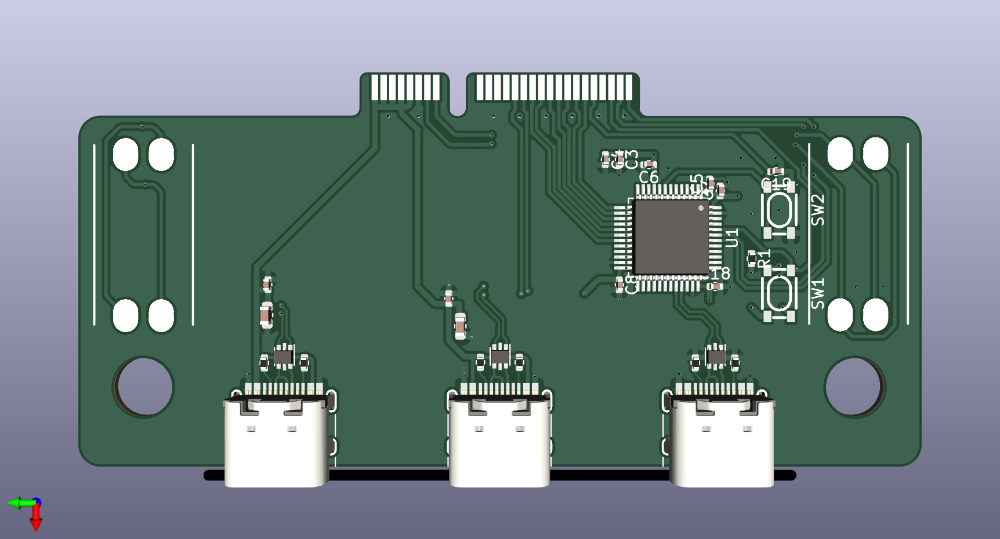

# uConsole_stm32_ext
STM32 extension card for uConsole.

Design is not finished and has not been tested.

Design based on dotcypress's uHub board, with identical USB port positioning: https://github.com/dotcypress/uhub

STM32 design learned from Sleepdealr's Kingsaver Replacement PCB: https://github.com/Sleepdealr/Kingsaver-Replacement-PCB

The goal is to get some of the functionality of both boards together, at a slightly lower manufacturing cost.

- Two USB C ports connected directly to the USB C pins, to avoid the need for a USB hub.
- STM32 replacing the RP2040, to avoid the need for crystal or flash components.
- Connecting the microcontroller to the uConsole via GPIO instead of USB, to both preserve uConsole’s USB lines and make the microcontroller’s USB lines externally accessible.
- Same USB C ports in the same position as the uHub, so the same faceplate should work for both.

With a CM4, you’d be able to program the STM32 over UART or I2C. With any other core, it will still work, but if they don’t have UART or I2C support for those pins, you might need to program the STM32 externally over USB.

The pins to program and reset the STM32 would be accessible either by physical button or over GPIO.

My main goal for the STM32 would be to use it as a USB HID device, sending keyboard commands to a headless computer over USB.

If I can find physical space on the board, I might also try to break out more microcontroller pins to possibly allow myself to solder in a sensor or LEDs or something.

Power management is dependent on the uConsole (there’s no on-board linear regulator, and the device USB port has it’s power line disconnected). In theory, I could change this?

This is my first STM32 project and my first fully assembled PCB project (I’ve only done keyboards before), so I’m not entirely sure what I’m doing.

https://forum.clockworkpi.com/t/stm32-ext-board-concept-thoughts/13368
